# Linux-Solus
# Solus

Solus es una distribución bastante conocida.
Basada en Arch Linux, también es de lanzamiento continuo (rolling release), 
pero al contrario del sistema del que deriva, Solus es muy amigable con el usuario, 
tanto, que recién instalada ya trae todo lo necesario para empezar a usar Steam.
 
 # Instalacion
instalacion paso a paso de Solus.

## 1. Descarga
Descargamos la imagen iso del SO [Solus][1_0] Budgie que pesa aproximadamente 2 Gb

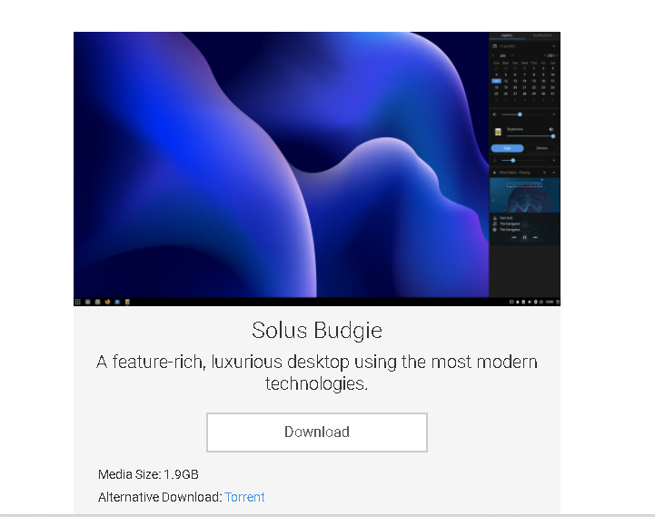

[1_0]:https://manjaro.org/downloads/official/xfce/ 

## 2. Maquina Virtual
Para poder instalar el SO vamos a hacer uso la maquina virtual [VirtualBox][1_1]
ya que por medio de esta podemos crear un SO sobre un SO y procedemos a crear la maquina virtual.

[1_1]:https://www.virtualbox.org/

## 2.1 Abrir la maquina virtual
Para acceder a nuestra  maquina virtual, se debe ingresar pormedio de su acceso rapido que se encuentra  nuestro caso en el escritorio            ![VirtualBox][1_2] 

[1_2]:https://www.virtualbox.org/
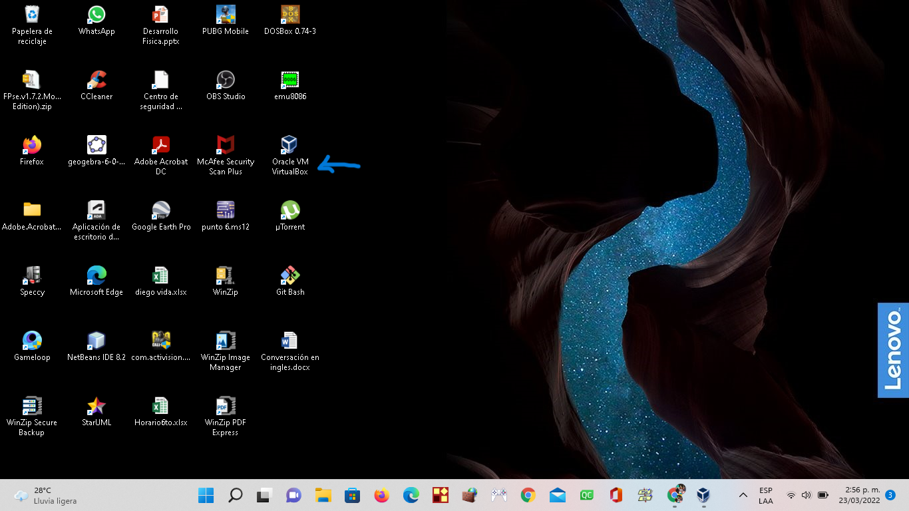

## 2.2 Crear la nueva maquina virtual
Una vez de haber accedido a nuestra maquina virtual, se le debe dar clic en el icono nueva

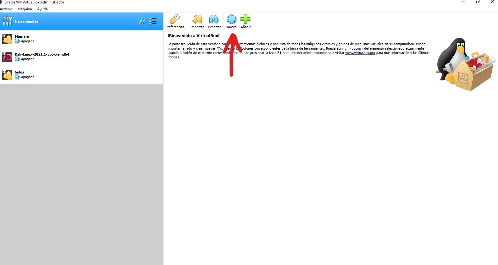

## 2.3 Nombre y ubicacion del SO
Organizar en que carpeta desea ubicar la maquina virtual, lo cual por defecto viene 
en una carpeta del mismo software
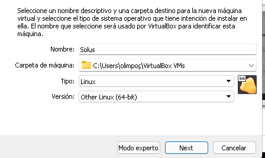

luego de esto presionar "Next".

## 2.4 Tamaño de memoria
Ahora nos aparece una ventana en la cual tenemos que asignar la cantidad de Memoria RAM, esta debe ser determinada por la cantidad de memoria ram que posee nuestro equipo,por ejemplo mi pc posee 8 de Ram, de las cuales 4 se le asignara a este SO.
Esta opcion puede ser por medio de la asignacion de memoria por medio de la barra o para ser muy preciso, se puede hacer manualmente.
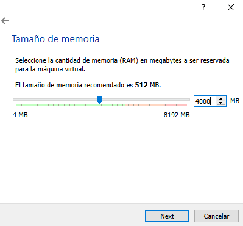

## 2.5 Disco Duro
Nuesta maquina virtual necesita un disco duro en el que almacenara toda la informacion que manejaremos ahi.
En esta pestaña nos da tres opciones, la primera nos la da para no añadir un disco duro, la segunda es para crear una disco duro
virtual y asi guardar informacion, la tercera y ultima opcion es por si depronto tenemos un archivo que anteriormente por ejemplo
hayamos utilizado como disco duro de otra maquina virtual y lo utilizariamos en la que estamos creando; en este caso le daremos en la segunda opcion
porque crearemos una nuevo.

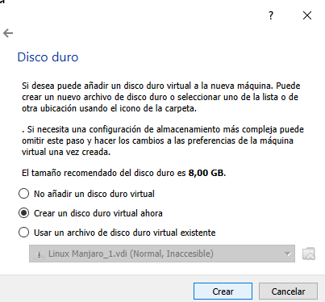

## 2.6 tipo de archivo de disco duro
* [VDI (VirtualBox Disk Image)][2.5.1]: es la selección por defecto,es la imagen de un disco duro virtual
     o el disco lógico asociado con una máquina virtual.
* [VHD (Virtual Hard Disk)][2.5.2]: es la opción a elegir si lo que queremos es crear un disco virtual
 versátil, que podamos recuperar cualquier archivo en su interior fácilmente. Se podrá utilizar
  como unidad de almacenamiento habitual y soporta particiones de todo tipo, como cualquier otro 
  disco duro, además de varios usuarios por cada SO virtual instalado en él. Se utiliza sobre 
  todo para Microsoft Virtual PC.

* [VMDK (VirtualBox Machine Disk)][2.5.2] es el formato típico de VMWare (otro software de virtualización,
    semejante a VirtualBox). Se escogerá esta opción para contar con plena compatibilidad entre 
    VMWare y VirtualBox y poder pasar sistemas operativos virtuales entre ambos softwares
     sin mayor problema.

En nuestro caso marcaremos la primera opcion VDI y presionaremos siguiente.

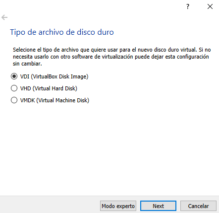

[2.5.1]:https://www.techopedia.com/definition/10933/virtual-disk-image-vdi
[2.5.2]:https://megazona.com/software/tipos-de-archivo-de-disco-duro-virtual-en-virtualbox

## 2.7 Almacenamiento de unidad fisica del disco duro
En este punto nos pide seleccionar si queremos nuestro disco duro <b>reservado dinamicamente </b> que solo se usara espacio
en el disco fisico a medida que se llena (hasta un maximo tamaño fijo), sin embargo
no se reducira de nuevo automaticamente cuando el espacio en él se libere o el <b>Tamaño fijo</b> que puede tomar
mas tiempo para su creacion en algunos sistemas, pero normalmente es mas rapido al usarlo.

En nuestro caso utilizaremos la opcion 1 puesto que queremos una candidad especifica para nuestro SO.

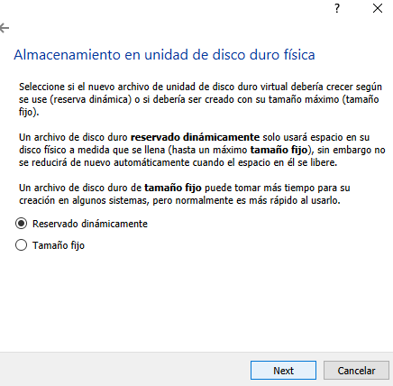

## 2.8 Ubicacion del archivo y tamaño
En este paso se debe crear un disco duro con un minimo de 10GB, porque esto es el requerimiento minimo de este SO.

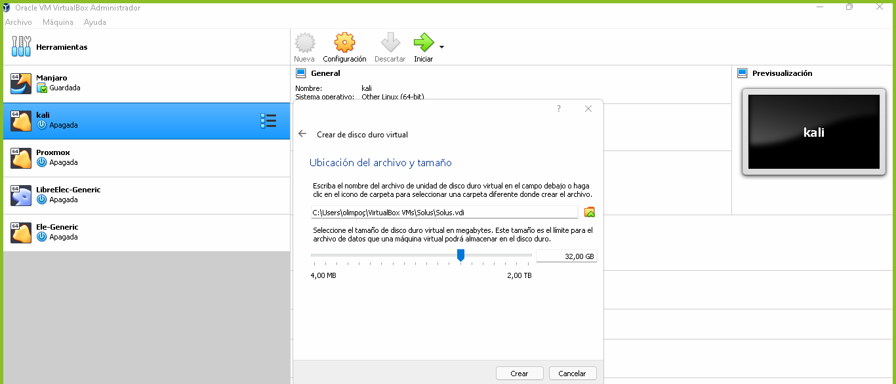

seleccionamos la opcion crear para crear nuestra maquina virtual. 

# 3. Configuraciones
una ves creada la maquina virtual, accedemos a las configuraciones de la misma para poder cargar nuestra
imagen iso que descargamos inicialmente; a continuacion mostraremos el paso a paso de la carfa de la imafen iso

## 3.1 Almacenamiento
En las configuraciones siempre nos salen opciones para poder modificar algo que depronto nos haga falta.

en esta ventana nos vamos al apartado de almacenamiento porque aqui es donde vamos a cargar la imagen iso
en una unidad de disco que se crea al momento de hacer el proceso del disco duro 
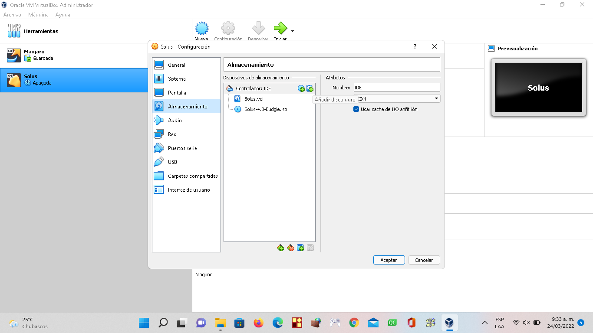

## 3.2 Selección del disco
Se selecciona el disco en la cual cargaremos la imagen

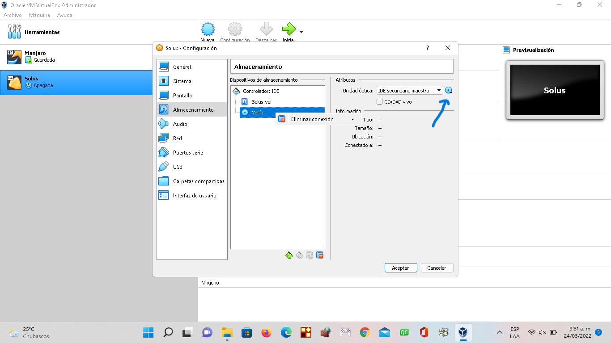

## 3.3 Busqueda
Seleccionamos en nuestros archivos la ubicación de nuestra imagen iso y la seleccionamos

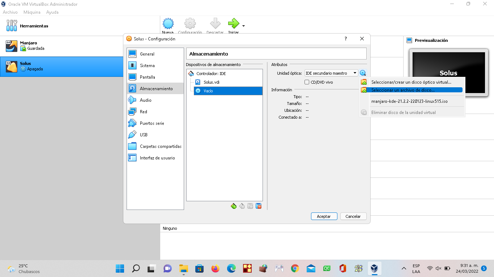

Posteriormente le damos en "aceptar" para cconfirmar nustra configuracion
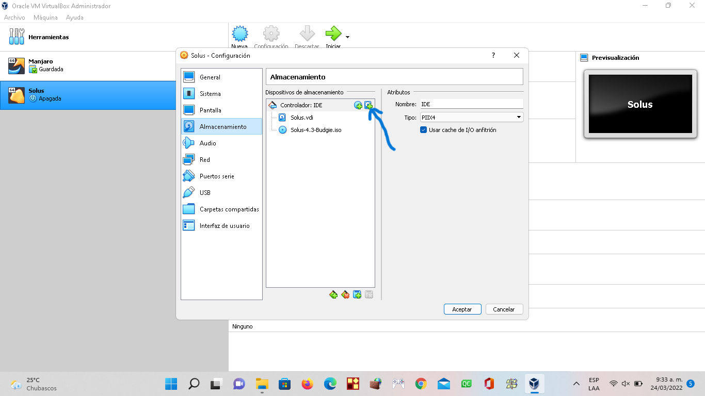

## 3.4 Crear
En este caso se necesita crear otra unidad para, asi que para crearla se necesita hacer lo siguiente
le damos en el controlador IDE y en l¿el icono de disco duro
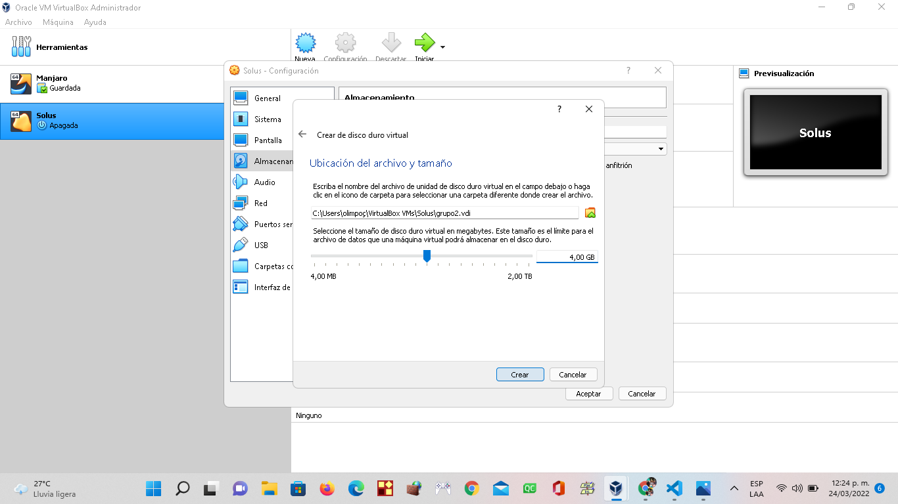

luego de eso, si se tiene la unidad ya creada, se selecciona, si no se debe crear con el icono que sale alli
y seguir los mismos pasos desde el punto <b>2.4</b> de este tutorial

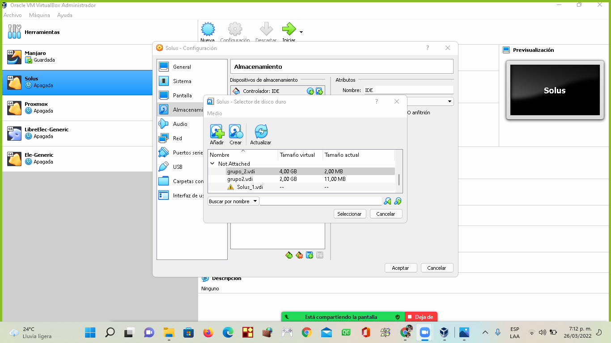

y para finalizarlo, asi quedaria el otro disco creado, en el mismos controlador IDE

# 4. Ejecutar SO
En este punto ya hemos creado y configurado nuestra maquina virtual con el SO Manjaro,
lo que sigue a continuacion es la ejecucion de de la maquina para ver si fue correctamente creada

y si es asi, se abrira un menu en la cual nos da las siguientes opciones

seleccionaremos la opcion "Boot with open source drivers", en este momento nos damos cuenta que 
nuestro SO fue cargado con exito, y procedemos a seleccionar esta opcion para poder tener la distribucion
completa puesto que Linux es un SO libre.

posterior a esto saldra la siguiente ventana que nos da una bienvenida al SO Manjaro 

## 4.1 Configuracion Manjaro
luego de esto procedemos a hacer las configuraciones basicas que tenemos que hacer 
para tener una buena experiencia en el SO.

Inicialmente se nos va a desplegar una ventana en al que esta el paso a paso de las configuraciones,

* iniciamos configurando el origen del equipo.

* Luego seleccionamos el idioma del teclado para utilizar

## Particiones de disco
En la siguiente ventana se presentan 2 opciones, la primera es borrar el disco, basicamente porque recien esta instalando el SO
y la otra es la opcion de conservar la informacion y realizar particiones, en nuestro caso, escogeriamos la segunda,
ya que necesitamos modificarlo

procedemos a hacer las particiones necesarios que cada usuario necesita
en este caso hare 2 partciciones en el primer disco y una sola en el segundo.

aqui nos muestra los Discos que tenemos con posibilidad de modificarlo

primero modificaremos el disco 1, lo seleccionamos y le damos borrar para hacer las particiones desde cero.

luego quedara disponible para modificacion toda la unidad, la seleccionamos y le damos crear para hacer 
la primera particion.

Aqui hay que tener algo encuenta, y es que en la primera particion se le pone de tamaño 
la misma cantidad de megas que se puso de memoria RAM al inicio de la instalacion, luego cambiamos la
opcion en sistemas de archivos y lo ponemos en <b>"linuxswap"</b> 

Asignamos el tamaño que queda en la otra particion para el disco, pero aqui hacemos una modificacion
ponemos el sistema de archivos en ext4 y le ponemos como punto de anclaje el <b>root ( / ) </b> que en este 
y le damos siguiente

como en este caso tenemos 2 discos, nos falta modificar el segundo disco y hacemos lo mismo que con el anterior
solo le dejamos todo el tamaño ya que solo sera una particion, y en el punto de anclase le ponemos <b>/home</b> el 
cual sera el almacenamiento de nuestros archivos <b>(en este ejercicio)</b>

para finalizar el area de particiones le damos siguiente (ok)

Siguiendo con la configuracion, nos muestra los datos del usuario, para seguir llenamos las correspondientes
casillas

para casi terminar la congifuracion de Manjaro, nos muestra un resumen de las configuraciones
anteriores que hicimos.

 para terminar le damos en el boton <b>instalar</b> para comenzar el proceso de instalacion

para finalizar, asi estaria el desktop de Manjaro listo para utilizarse.

# Tutotial hecho por:
* Diego Marcelo Jimenez Melendez
* Jhon Fabio España Cortes
* Errol Vladimir Garcia Silva

Universidad De Nariño
