# Linux-Solus
# Solus

Solus es una distribución bastante conocida.
Basada en Arch Linux, también es de lanzamiento continuo (rolling release), 
pero al contrario del sistema del que deriva, Solus es muy amigable con el usuario, 
tanto, que recién instalada ya trae todo lo necesario para empezar a usar Steam.
 
 # Instalación
La instalación paso a paso de Solus.

## 1. Descarga
Descargamos la imagen iso del SO [Solus][1_0] Budgie que pesa aproximadamente 2 Gb

[1_0]:https://manjaro.org/downloads/official/xfce/ 

## 2. Máquina Virtual
Para poder instalar el SO vamos a hacer uso la máquina virtual [VirtualBox][1_1]
ya que por medio de esta podemos crear un SO sobre un SO y procedemos a crear la máquina virtual.

[1_1]:https://www.virtualbox.org/

## 2.1 Abrir la máquina virtual
Para acceder a la  máquina virtual, se debe ingresar por medio de su acceso rápido que se encuentra  en nuestro caso en el escritorio .           ![VirtualBox][1_2] 

[1_2]:https://www.virtualbox.org/

## 2.2 Crear la nueva máquina virtual
Una vez de haber accedido a la máquina virtual, se le debe dar clic en el icono nueva

## 2.3 Nombre y ubicación del SO
Organizar en que carpeta desea ubicar la máquina virtual, lo cual por defecto viene 
en una carpeta del mismo software

luego de esto presionar "Next".

## 2.4 Tamaño de memoria
Ahora nos aparece una ventana en la cual tenemos que asignar la cantidad de Memoria RAM, esta debe ser determinada por la cantidad de memoria Ram que posee nuestro equipo, por ejemplo, mi pc posee 8 de Ram, de las cuales 4 se le asignara a este SO.
Esta opción puede ser por medio de la asignación de memoria por medio de la barra o para ser muy preciso, se puede hacer manualmente. Después se da clic en next.

## 2.5 Disco Duro
La máquina virtual necesita un disco duro en el que almacenara toda la información que manejaremos ahí.
En esta pestaña nos da tres opciones, la primera nos la da para no añadir un disco duro, la segunda es para crear un disco duro
virtual y asi guardar información, la tercera y última opción es por si de pronto tenemos un archivo que anteriormente por ejemplo
hayamos utilizado como disco duro de otra máquina virtual y lo utilizaríamos en la que se esta creando; en este caso le daremos en la segunda opción,
porque crearemos una nuevo.

## 2.6 tipo de archivo de disco duro
* [VDI (VirtualBox Disk Image)][2.5.1]: es la selección por defecto, es la imagen de un disco duro virtual
     o el disco lógico asociado con una máquina virtual.
* [VHD (Virtual Hard Disk)][2.5.2]: es la opción a elegir si lo que queremos es crear un disco virtual
 versátil, que podamos recuperar cualquier archivo en su interior fácilmente. Se podrá utilizar
  como unidad de almacenamiento habitual y soporta particiones de todo tipo, como cualquier otro 
  disco duro, además de varios usuarios por cada SO virtual instalado en él. Se utiliza sobre 
  todo para Microsoft Virtual PC.

* [VMDK (VirtualBox Machine Disk)][2.5.2] es el formato típico de VMWare (otro software de virtualización,
    semejante a VirtualBox). Se escogerá esta opción para contar con plena compatibilidad entre 
    VMWare y VirtualBox y poder pasar sistemas operativos virtuales entre ambos softwares
     sin mayor problema.

En este caso se marcará la primera opción VDI y presionaremos siguiente.

[2.5.1]:https://www.techopedia.com/definition/10933/virtual-disk-image-vdi
[2.5.2]:https://megazona.com/software/tipos-de-archivo-de-disco-duro-virtual-en-virtualbox

## 2.7 Almacenamiento de unidad fisica del disco duro
En este punto nos pide seleccionar si queremos nuestro disco duro <b>reservado dinámicamente </b> que solo se usara espacio
en el disco fisico a medida que se llena (hasta un maximo tamaño fijo), sin embargo,
no se reducira de nuevo automáticamente cuando el espacio en él se libere o el <b>Tamaño fijo</b> que puede tomar
mas tiempo para su creación en algunos sistemas, pero normalmente es mas rápido al usarlo.

En nuestro caso utilizaremos la opción 1 puesto que queremos una cantidad específica para nuestro SO.

## 2.8 Ubicación del archivo y tamaño
En este paso se debe crear un disco duro con un mínimo de 10GB, porque esto es el requerimiento del  SO, sin embargo, en este ejercicio se creó el disco duro con la capacidad de 32GB

seleccionamos la opción crear para crear la máquina virtual. 

# 3. Configuraciones
una vez creada la máquina virtual, accedemos a las configuraciones de la misma para poder cargar nuestra
imagen iso que descargamos inicialmente; a continuación mostraremos el paso a paso de la carga de la imagen iso

## 3.1 Almacenamiento
En las configuraciones siempre nos salen opciones para poder modificar algo que de pronto nos haga falta.

en esta ventana nos vamos al apartado de almacenamiento,porque aquí es donde vamos a cargar la imagen iso
en una unidad de disco que se crea al momento de hacer el proceso del disco duro 

## 3.2 Selección del disco
Se selecciona el disco en la cual cargaremos la imagen

## 3.3 Búsqueda
Seleccionamos en nuestros archivos la ubicación de nuestra imagen iso y la seleccionamos

Posteriormente le damos en "aceptar" para confirmar la configuración

## 3.4 Crear
En este caso se necesita crear otra unidad para, así que para crearla se necesita hacer lo siguiente
le damos en el controlador IDE y en el icono de disco duro

luego de eso, si se tiene la unidad ya creada, se selecciona, si no se debe crear con el icono que sale alli
y seguir los mismos pasos desde el punto <b>2.4</b> de este tutorial

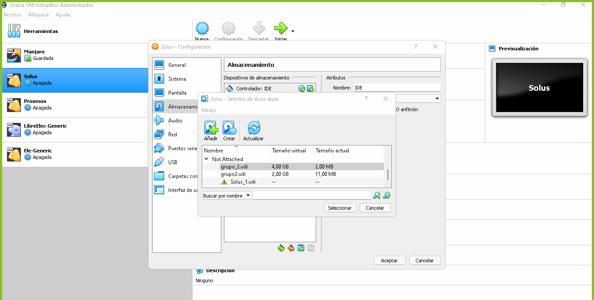
y para finalizarlo, así quedaría el otro disco creado, en el mismos controlador IDE

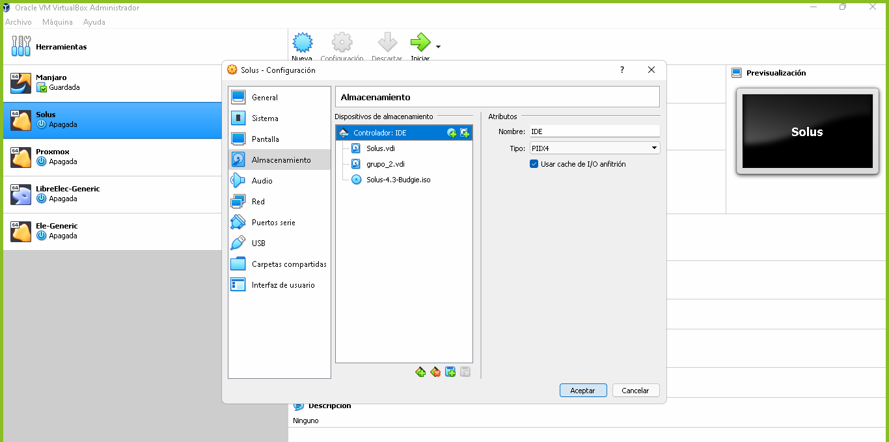

# 4. Ejecutar SO
En este punto ya hemos creado y configurado la máquina virtual con el SO Solus,
lo que sigue a continuación es la ejecución de la máquina para ver si fue correctamente creada y le damos clic en el icono iniciar.

# 4.1 crear las particiones del primer disco
una vez ingresado en la interfaz nos dirigimos a la parte inferior izquierdo y le damos clic en el conjunto de cuadros

una vez le demos clic en los cuadros, se dirigen a la barra de búsqueda e ingresamos Gparted y le damos clic

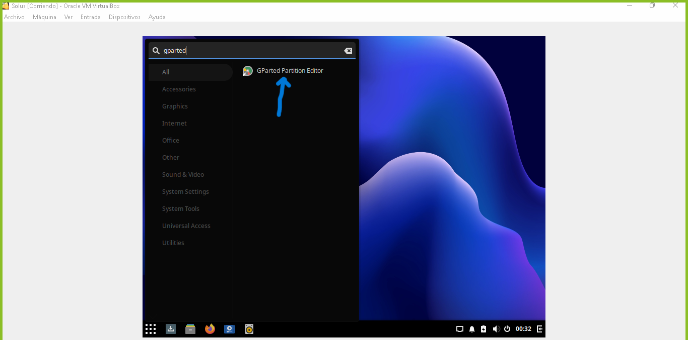

en este punto se puede disponer a crear la partición del disco de 32MG de los discos.
se da clic en el botón device y se escoge la opción

Se selecciona el tipo de partición y se da clic en el botón apply

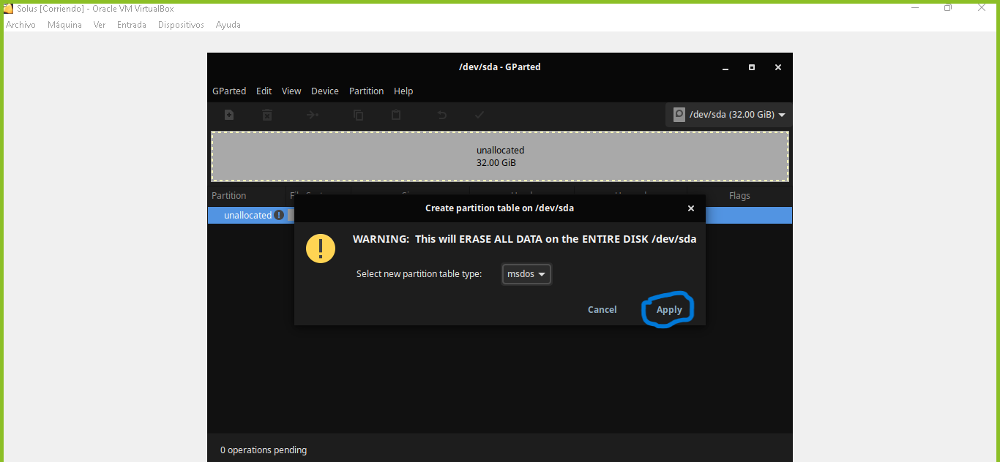

despues de estos pasos se da clic derecho del mouse en la linea de color azul y se escoge la opcion new

 
 El próximo paso es colocar los valores que aparecen en la imagen y dar clic en el botón add

 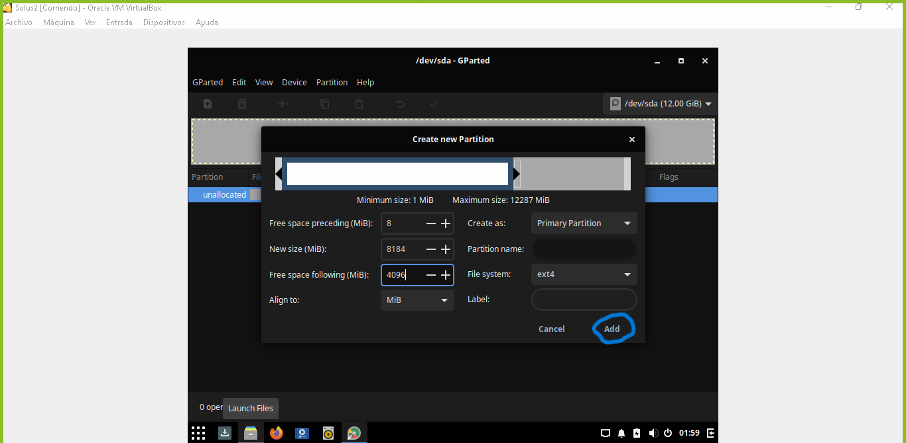

 En el último paso de la partición del disco le damos en la opción close

  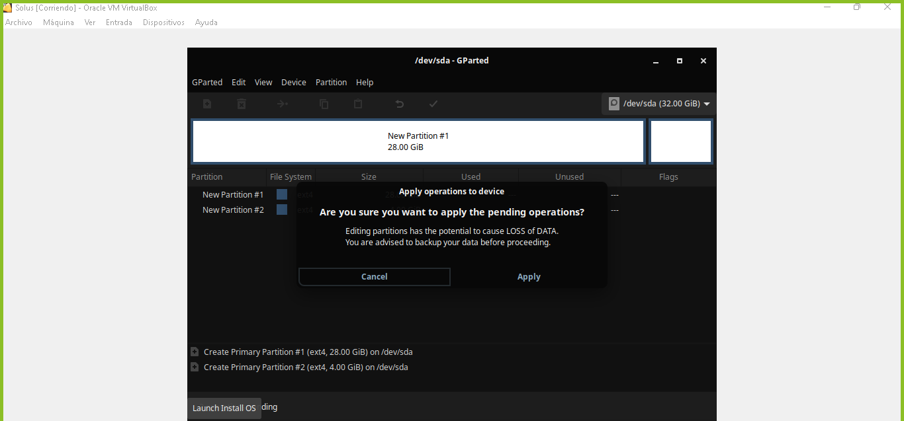

  # 4.2 Crear las particiones del segundo disco

  En la esquina superior derecha, desplegamos la lista y escogemos el disco de 4GB

   

   En este disco se realizan los mismos pasos, solo que se deben colocar los valores que están en la imagen y se le da clic en el botón add

   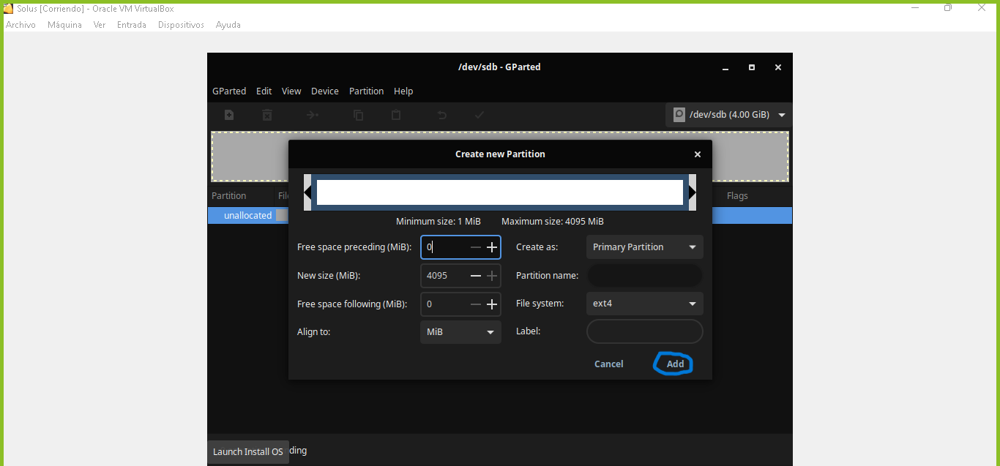

Se continua con los mismos pasos de la partición del primer disco hasta llegar al final y se le da clic en el botón cancelar

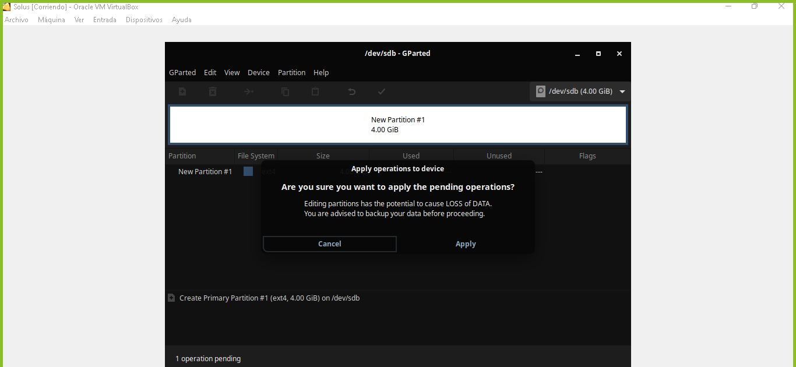

# 4.3 Comprobar si fue realizado bien los pasos

A continuación se presenta la imagen que muestra la configuración correcta de los pasos

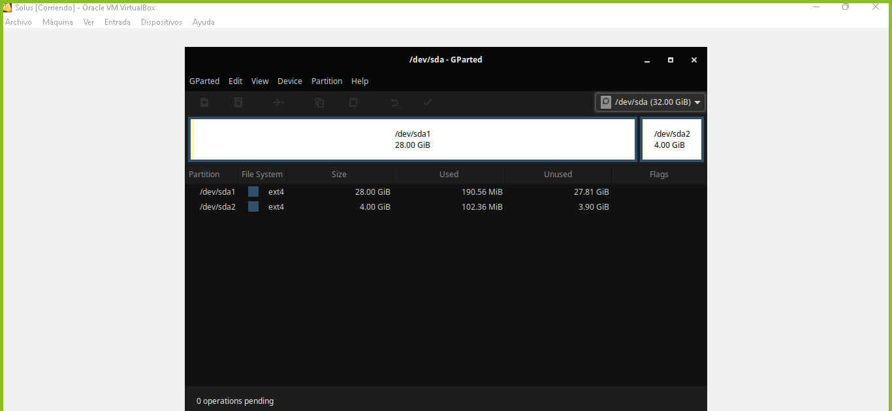

# 4.4 Configuracion install os
Esta es la configuración que continua una vez terminada la configuración de la partición de los discos
En la interfaz de Solus se ingresa en install os

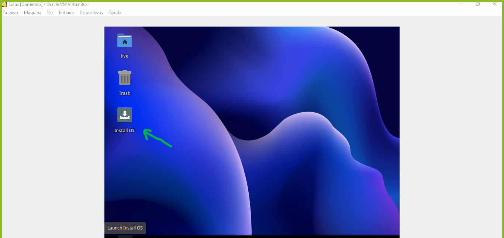

Configuracion del idioma y se le da en el boton next

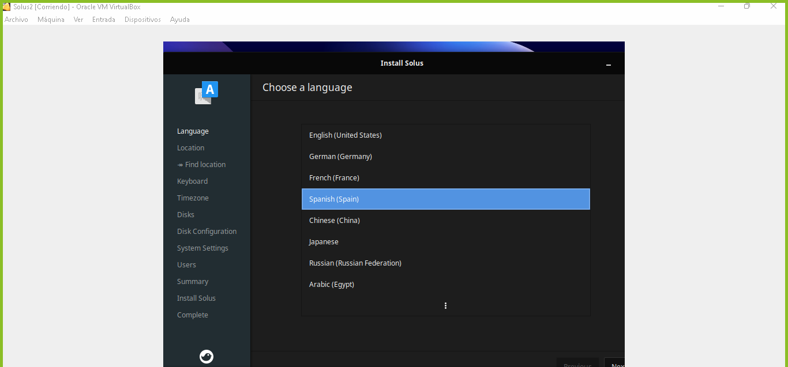

Se configura la ubicación y se le da clic en el botón next

Se configura el idioma del teclado y se le da clic en el botón next

Se configura la zona horaria y se le da clic en el botón next

Se debe seleccionar la segunda opción, porque se crearon los discos con sus particiones y se le da clic en el botón next

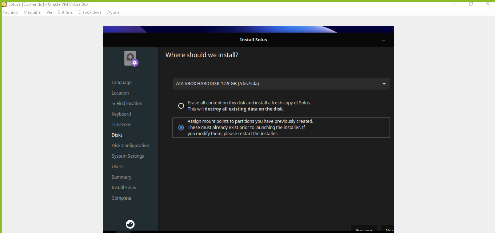

Se debe dejar igual a la configuración de la imagen y se le da clic en el botón next

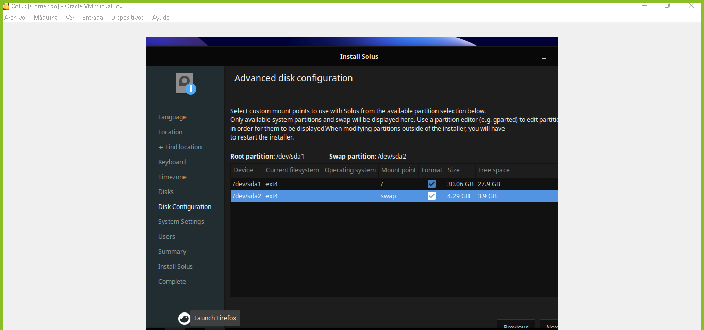

Configura el motor de arranque

se introduce los datos de la persona que utiliza la maquina

la máquina arroja los datos que ella va a utilizar

En este punto se da clic en el botón install

En este punto se ha terminado la instalación del SO linux Solus

# 4.5 configurar las carpetas

en este paso debemos colocar las carpetas en las diferentes particiones de los discos, para ello se debe  dirigir a la interfaz de Solus y seleccionar en la parte inferior izquierda los cuadros.

una vez realizado este paso, se dirige a la barra de búsqueda y escribe terminal

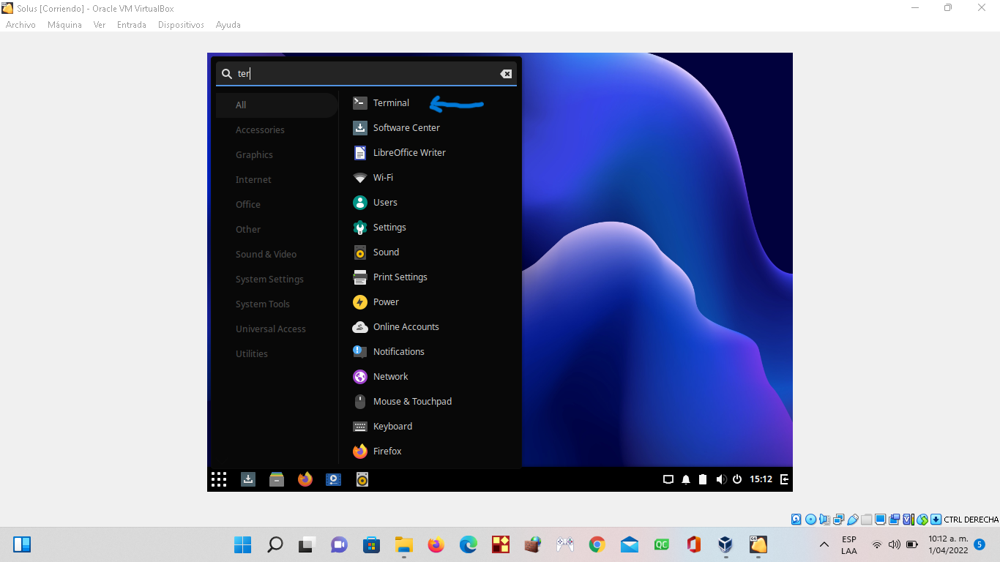

una vez haya ingresado se deben colocar los siguientes comandos sudo fdisk/dev/sdb, después le pide un comando y de presionar la tecla p y ya le aparecerán las particiones de los discos

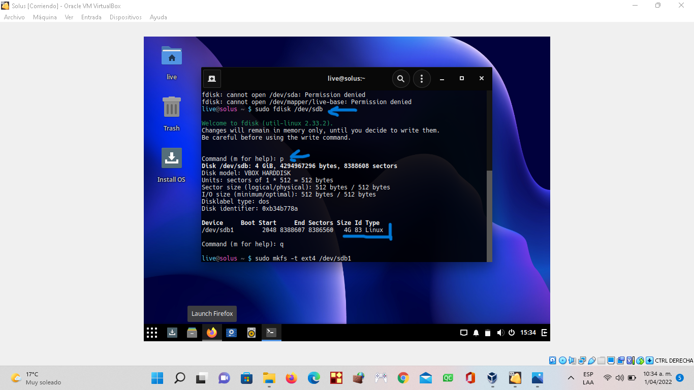

 Una vez realizado este paso nos pide que insertemos un comando y presionamos q para salir

# 4.6 crear un sistema de archivos en la partición

Esto se logra fácilmente con el comando sudo mkfs -t ext4/dev/sdb1
 
 Una vez realizado este paso, el sistema nos pregunta si deseamos proseguir, por lo que debemos presionar la tecla (y) de si

 Ahora debemos pasar los archivos que se crearon en el sistema a las diferentes unidades de disco, aquí utilizamos los comandos para que estos conserven las propiedades de los archivos y comandos

sudo cp-rp/home/*/mnt

y para comprobar que los archivos están en el lugar correcto escribimos el comando ls

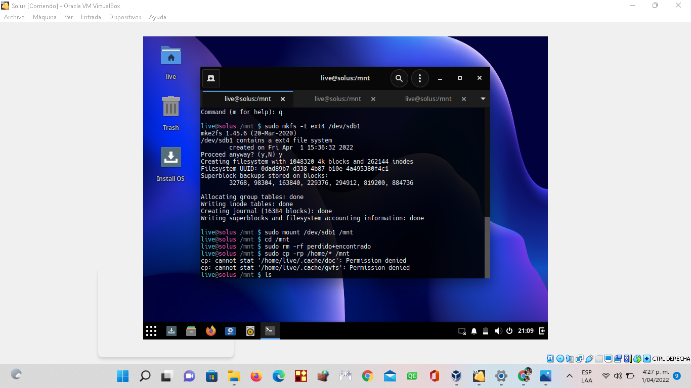

# 4.8 comprobación de los pasos realizados

Se debe ingresar a la interfaz de Solus y seleccionar en la imagen marcada 

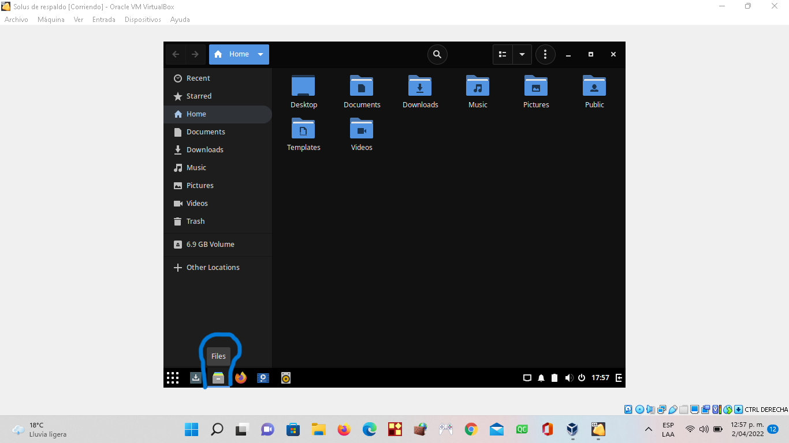

se le da clic en la pestaña home para ver las carpetas se le da clic en home

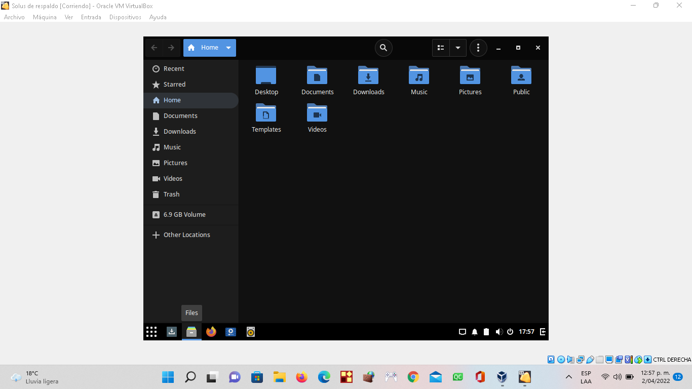

ahora se da click en other locations y en 4.3GB 

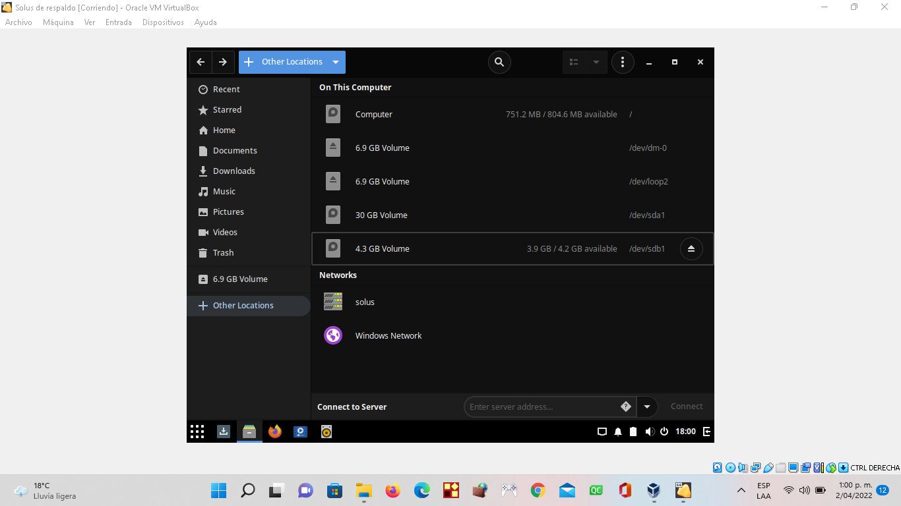

Una vez haya ingresado le aparece la carpeta life

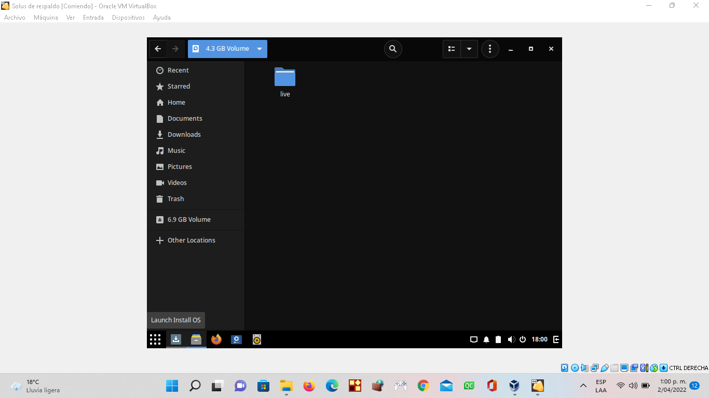

 y dentro de esta carpeta se encuentran las diferentes carpetas del SO

 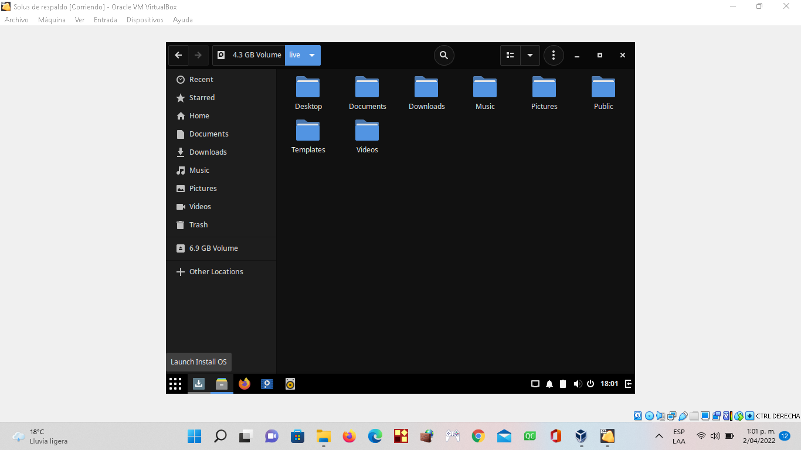

 una vez comprobado que las carpetas están en sus debidas particiones...se puede decir que se teminó la instalación y configuración de Solus Budgie

 # LABORATORIO #2

 # 2.1 Consultar la fundación o empresa que esta detráss de la distribución "Solus Budgie"

 Esta distribución fue creada por  Ikey Doherty en el año 2015

 # 2.2 consultar las ventajas de Solus Budgie sobre los demás

La distribución Solus utiliza una version derivada del gestor de paquetes PiSi, llamada eopkg, también utiliza su propio centro de software, en cuanto al escritorio Budgie es un escritorio muy rápido, fluido y personalizable. Además viene con los diferentes drivers para los últimos componentes de hardware, incluso los últimos procesadores de Intel y AMD, y las últimas graficas Radeon y NVIDIA

# 3 Consulte el entorno de escritorio que viene el Solus y agregue algunas ventajas

El entorno de escritorio es Budgie, este entorno es muy rápido, fluido y personalizable. Además este entorno de escritorio es minimalista. 

# 4.1 Consulte el nombre del explorador de archivos de solus

El nombre del explorador de archivos es Nautilus

# 4.2 cuales son las ventajas del explorador de archivos de linux solus?

Una de sus principales ventajas es la capacidad de mostrar con mayor exactitud  los archivos recientes

# 5.1 consulte el tipo de paquete

estos son los tipos de paquete que tiene el linux Solus

# 5.2 El sistema de gestion de paquetes

El sistema de gestión de paquetes que utiliza Solus es el paquete eopkg para entregar software al usuario final.

# 6 Consulte el modelo de lanzamiento de linux solus

Linux Solus se convirtió en una distribución de lanzamiento rodante curado. Es una versión continua en el sentido de que una vez instalada, los usuarios finales tienen la garantía de recibir continuamente actualizaciones de seguridad y software para su instalación de Solus

# Tutotial hecho por:
* Diego Marcelo Jimenez Melendez
* Jhon Fabio España Cortes
* Errol Vladimir Garcia Silva

Universidad De Nariño
