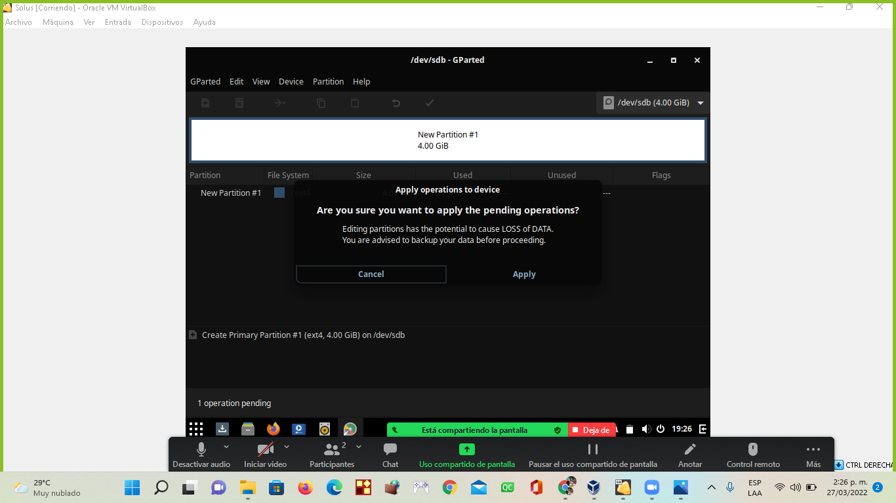
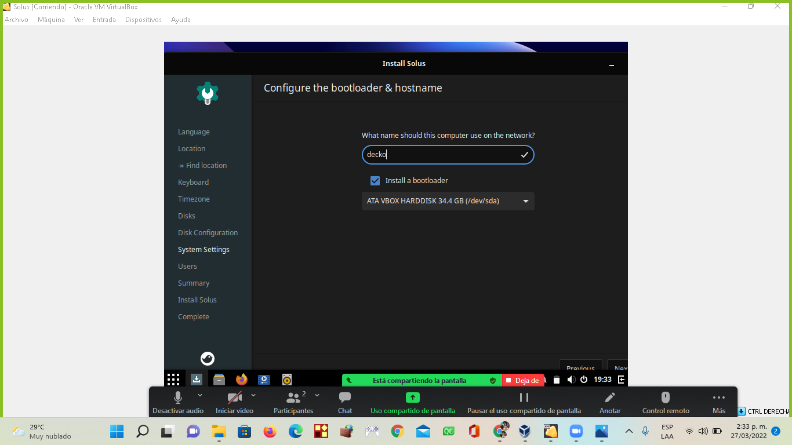
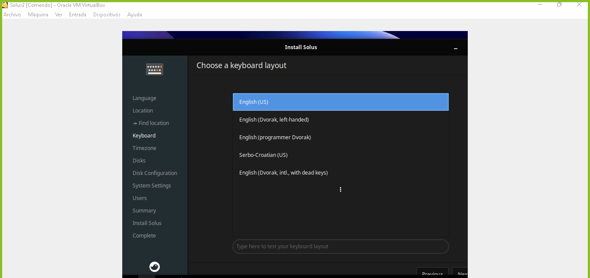

# Linux-Solus
# Solus

Solus es una distribución bastante conocida.
Basada en Arch Linux, también es de lanzamiento continuo (rolling release), 
pero al contrario del sistema del que deriva, Solus es muy amigable con el usuario, 
tanto, que recién instalada ya trae todo lo necesario para empezar a usar Steam.
 
 # Instalacion
instalacion paso a paso de Solus.

## 1. Descarga
Descargamos la imagen iso del SO [Solus][1_0] Budgie que pesa aproximadamente 2 Gb

[1_0]:https://manjaro.org/downloads/official/xfce/ 

## 2. Maquina Virtual
Para poder instalar el SO vamos a hacer uso la maquina virtual [VirtualBox][1_1]
ya que por medio de esta podemos crear un SO sobre un SO y procedemos a crear la maquina virtual.

[1_1]:https://www.virtualbox.org/

## 2.1 Abrir la maquina virtual
Para acceder a nuestra  maquina virtual, se debe ingresar pormedio de su acceso rapido que se encuentra  nuestro caso en el escritorio            ![VirtualBox][1_2] 

[1_2]:https://www.virtualbox.org/

## 2.2 Crear la nueva maquina virtual
Una vez de haber accedido a nuestra maquina virtual, se le debe dar clic en el icono nueva

## 2.3 Nombre y ubicacion del SO
Organizar en que carpeta desea ubicar la maquina virtual, lo cual por defecto viene 
en una carpeta del mismo software

luego de esto presionar "Next".

## 2.4 Tamaño de memoria
Ahora nos aparece una ventana en la cual tenemos que asignar la cantidad de Memoria RAM, esta debe ser determinada por la cantidad de memoria ram que posee nuestro equipo,por ejemplo mi pc posee 8 de Ram, de las cuales 4 se le asignara a este SO.
Esta opcion puede ser por medio de la asignacion de memoria por medio de la barra o para ser muy preciso, se puede hacer manualmente.

## 2.5 Disco Duro
Nuesta maquina virtual necesita un disco duro en el que almacenara toda la informacion que manejaremos ahi.
En esta pestaña nos da tres opciones, la primera nos la da para no añadir un disco duro, la segunda es para crear una disco duro
virtual y asi guardar informacion, la tercera y ultima opcion es por si depronto tenemos un archivo que anteriormente por ejemplo
hayamos utilizado como disco duro de otra maquina virtual y lo utilizariamos en la que estamos creando; en este caso le daremos en la segunda opcion
porque crearemos una nuevo.

## 2.6 tipo de archivo de disco duro
* [VDI (VirtualBox Disk Image)][2.5.1]: es la selección por defecto,es la imagen de un disco duro virtual
     o el disco lógico asociado con una máquina virtual.
* [VHD (Virtual Hard Disk)][2.5.2]: es la opción a elegir si lo que queremos es crear un disco virtual
 versátil, que podamos recuperar cualquier archivo en su interior fácilmente. Se podrá utilizar
  como unidad de almacenamiento habitual y soporta particiones de todo tipo, como cualquier otro 
  disco duro, además de varios usuarios por cada SO virtual instalado en él. Se utiliza sobre 
  todo para Microsoft Virtual PC.

* [VMDK (VirtualBox Machine Disk)][2.5.2] es el formato típico de VMWare (otro software de virtualización,
    semejante a VirtualBox). Se escogerá esta opción para contar con plena compatibilidad entre 
    VMWare y VirtualBox y poder pasar sistemas operativos virtuales entre ambos softwares
     sin mayor problema.

En nuestro caso marcaremos la primera opcion VDI y presionaremos siguiente.

[2.5.1]:https://www.techopedia.com/definition/10933/virtual-disk-image-vdi
[2.5.2]:https://megazona.com/software/tipos-de-archivo-de-disco-duro-virtual-en-virtualbox

## 2.7 Almacenamiento de unidad fisica del disco duro
En este punto nos pide seleccionar si queremos nuestro disco duro <b>reservado dinamicamente </b> que solo se usara espacio
en el disco fisico a medida que se llena (hasta un maximo tamaño fijo), sin embargo
no se reducira de nuevo automaticamente cuando el espacio en él se libere o el <b>Tamaño fijo</b> que puede tomar
mas tiempo para su creacion en algunos sistemas, pero normalmente es mas rapido al usarlo.

En nuestro caso utilizaremos la opcion 1 puesto que queremos una candidad especifica para nuestro SO.

## 2.8 Ubicacion del archivo y tamaño
En este paso se debe crear un disco duro con un minimo de 10GB, porque esto es el requerimiento minimo de este SO.

seleccionamos la opcion crear para crear nuestra maquina virtual. 

# 3. Configuraciones
una ves creada la maquina virtual, accedemos a las configuraciones de la misma para poder cargar nuestra
imagen iso que descargamos inicialmente; a continuacion mostraremos el paso a paso de la carfa de la imafen iso

## 3.1 Almacenamiento
En las configuraciones siempre nos salen opciones para poder modificar algo que depronto nos haga falta.

en esta ventana nos vamos al apartado de almacenamiento porque aqui es donde vamos a cargar la imagen iso
en una unidad de disco que se crea al momento de hacer el proceso del disco duro 

## 3.2 Selección del disco
Se selecciona el disco en la cual cargaremos la imagen

## 3.3 Busqueda
Seleccionamos en nuestros archivos la ubicación de nuestra imagen iso y la seleccionamos

Posteriormente le damos en "aceptar" para cconfirmar nustra configuracion

## 3.4 Crear
En este caso se necesita crear otra unidad para, asi que para crearla se necesita hacer lo siguiente
le damos en el controlador IDE y en l¿el icono de disco duro

luego de eso, si se tiene la unidad ya creada, se selecciona, si no se debe crear con el icono que sale alli
y seguir los mismos pasos desde el punto <b>2.4</b> de este tutorial

y para finalizarlo, asi quedaria el otro disco creado, en el mismos controlador IDE

# 4. Ejecutar SO
En este punto ya hemos creado y configurado nuestra maquina virtual con el SO Solus,
lo que sigue a continuacion es la ejecucion de de la maquina para ver si fue correctamente creada y le damos clic en el icono iniciar.

En este paso se nos abre la interfaz de solus, aqui debemos de darle en la opcion install os

# 4.1 crear las particiones del primer disco
una vez ingresado en la interfaz nos dirigimos a la parte inferior izquierdo y le damos click en el conjunto de cuadros

una vez le demos click en los cuadros, se dirigen a la barra de busqueda e ingresamos gparted y le damos clic

en este punto se puede disponer a crear la particion del dico de 32MG de los discos.
se da click en el boton device y se escoge la opcion

Se selecciona el tipo de particion y se da clici en el boton apply

despues de estos pasos se da clic derecho del mouse en la linea de color azul y se escoge la opcion new

 
 El proximo paso es colocar los valores que aparecen en la imagen y dar click en el boton add

 

 En el ultimo paso de la particion del disco le damos en la opcion close

  

  # 4.2 Crear las particiones del segundo disco

  En la esquina superior derecha, desplegamos la lista y escogemos el disco de 4GB

   

   En este disco se realizan los mismos pasos, solo que se deben colocar los valores que estan en la imagen y se le da click en el boton add

   

Se continua con los mismos pasos del la particion del primer disco hasta llegar al final y se le da click en el boton cancelar

# 4.3 Comprobar si fue realizado bien los pasos

A continuacion se presenta la imagen que muestra la configuracion correcta de los pasos

Continuando con la configuracion se escoge la segunda opcion 

Se debe realizar la configuracion que se muestra en la imagen

# 4.4 Configuracion del sistema
aqui se le debe colocar un nombre a la maquina para identificarla en la red

# 4.5 Datos de la maquina

Aqui se introduce los datos de la persona que utilizara la maquina

La maquina arroja los datos de ella

En este punto se le da click en el boton install

ultimo paso en la configuracion de la particion de los discos y se le da click en el boton restart now

# Configuracion install os
En esta configuracion es cuando aparece la interfas de solus y se le da click en install os

Configuracion del idioma y se le da en el boton next

Se configura la ubicacion y se le da click en el boton next

Se configura el idioma del teclado y se le da click en el boton next

Se configura la zona horaria y se le da click en el boton next

Se debe seleccionar la segunda opcion porque se crearon los discos con sus particiones y se le da click en el boton next

Se debe dejar igual la configuracion a la imagen y se le da click en el boton next

Configura el motor de arranque

se introduce los datos de la persona que utiliza la maquina

la maquina arroja los datos que ella va a utilizar

En este punto se da click en el boton install

En este punto se ha terminado la instalacion del SO linux Solus

# Tutotial hecho por:
* Diego Marcelo Jimenez Melendez
* Jhon Fabio España Cortes
* Errol Vladimir Garcia Silva

Universidad De Nariño
